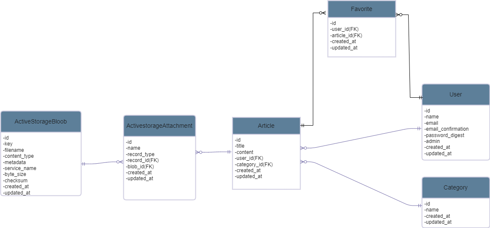

# BLOG APP

## Qu'est ce Blog app ?
Blog app est une application web qui permet de créer et de consulter des articles de blogs entre passionnés de différents domaines

## Language de programmmation et Framework
* Ruby version
3.0.1
* Rails version
6.0.6

## How to run the website

``` 
git clone https://github.com/Abdoul08/my_blog_app.git
 
cd bus_station

bundle install

yarn install --check-filesrails db:create && rails db:migrate

rails s
```

## Catalog design and table definition
https://docs.google.com/spreadsheets/d/13YXJNXkbSOHw12lNu7gXT454jpl-rff0TVh1Ty27B-Y/edit?usp=sharing

## wireframe
https://www.figma.com/file/ST8oMlq6KXQGpma4fvIOnh/Untitled?type=design&node-id=0%3A1&mode=design&t=bI16IksDF6aVtoFx-1

## ER diagramm


## Screen transition diagram

